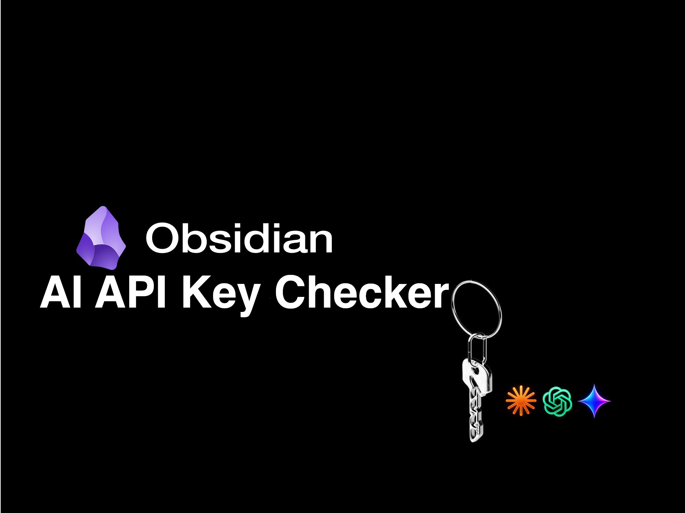

<p align="center">
  
</p>

<h1 align="center">AI API Key Checker</h1>

<p align="center">
  Validate API keys and detect rate limits for <b>21 AI providers</b> — right inside Obsidian, in one click.
</p>

<p align="center">
  <a href="https://www.typescriptlang.org/"></a>
  <a href="https://obsidian.md/"></a>
  <a href="https://github.com/Kigrok/api-key-checker/releases"></a>
  <a href="https://github.com/Kigrok/api-key-checker/releases"></a>
  
  
</p>

---

## ✨ Features

- **Instant validation** — every key is checked against the real provider API, not a regex.
- **Rate-limit & balance detection** — tells apart a *bad key* from a *good key with no quota*, and shows exactly when the limit resets: `LIMIT — 17:20` or `LIMIT — 07.11 15:00`.
- **Bulk check** — paste 50+ keys at once, get results in seconds.
- **Smart sorting** — broken keys float to the top so you spot problems first.
- **Click to copy** — click a masked key to copy it; hover to reveal the full value.
- **Stats bar** — `12 OK | 3 LIMIT | 2 INVALID (17 total)` at a glance.
- **Last-check time** — see when each provider was last verified.

---

## 📦 Installation

### Manual

1. Download `main.js`, `manifest.json`, and `styles.css` from the [latest release](../../releases/latest).
2. Drop them into `YourVault/.obsidian/plugins/api-key-checker/`:
   ```
   YourVault/.obsidian/plugins/api-key-checker/
   ├── main.js
   ├── manifest.json
   └── styles.css
   ```
3. In Obsidian: **Settings → Community plugins → Reload**, then enable **AI API Key Checker**.

### Via BRAT

Add this repository in the [BRAT](https://github.com/TfTHacker/obsidian42-brat) plugin to auto-update from releases.

---

## 🚀 Usage

1. Click the **key** icon in the left ribbon (or run the command **AI API Key Checker: Open panel**).
2. Hit **Add key**, pick a provider, paste one or more keys (one per line).
3. Read the results — grouped by provider, worst status first.

---

## 🔌 Supported providers

<details>
<summary><b>21 providers</b> — click to expand</summary>

| Provider | Check Method | Notes |
|---|---|---|
|  OpenAI | `/v1/models` | |
|  Anthropic | `/v1/models` | |
|  Google Gemini | Model list + Gemini probe | Detects daily quota reset |
|  Groq | `/v1/models` | |
|  Grok | Chat completion (grok-3) | |
|  FreeModel | Anthropic messages API | Parses reset time from 402 |
|  Aerolink | Anthropic messages API | |
|  OpenRouter | Chat completion | Shows balance |
|  Kimchi | Anthropic messages API | Detects rate limit via error body |
|  OpenCode Zen | Chat completion (free model) | |
|  Xiaomi MiMo | `/v1/models` | Bearer auth |
|  Amazon Bedrock | Model invoke (nova-lite) | Detects proxy limitations |
|  Z.ai | Chat completion (glm-5) | |
|  InferAll | `/v1/models` | |
|  Inception | Chat completion (mercury-2) | |
|  Fireworks | Chat completion (deepseek-v4-pro) | |
|  Abliteration | Chat completion (abliterated-model) | |
|  Anyapi | Chat completion (free model) | |
|  Auriko | Chat completion (gpt-3.5-turbo) | |
|  v0 | `/v1/chats` | |
|  Featherless | Chat completion (Mistral-7B) | |

</details>

---

## 🎯 Status legend

| Status | | Meaning |
|:---:|---|---|
| `OK` | 🟢 | Key is valid and working |
| `LIMIT` | 🟡 | Key works but is rate-limited or out of credits (shows reset time) |
| `INVALID` | 🔴 | Key rejected — check for typos or expiry |
| `ERROR` | 🟠 | Network issue or the provider is down |

---

## 🔒 Privacy

Your keys never leave your machine except to reach the provider you are validating.
There is no telemetry, no analytics, and no third-party server in between.
Keys are stored locally in `.obsidian/plugins/api-key-checker/data.json` — treat that file as a secret and never commit it.
The **click-to-copy** feature writes the selected key to your system clipboard only when you click it; the plugin never reads clipboard content.

---

## 🛠️ Development

```bash
npm install       # install dev dependencies
npm run dev       # watch-mode build (esbuild)
npm run build     # type-check + minified production bundle -> main.js
npm run lint      # ESLint (typescript-eslint + eslint-plugin-obsidianmd)
```

Source lives in `src/` (`main.ts` = UI/plugin lifecycle, `checker.ts` = validation engine). Obsidian only loads the bundled `main.js`, so rebuild after every change. Adding a provider is a five-step change — see `CLAUDE.md`.

---

## 📄 License

[MIT](LICENSE) © VenvStore
